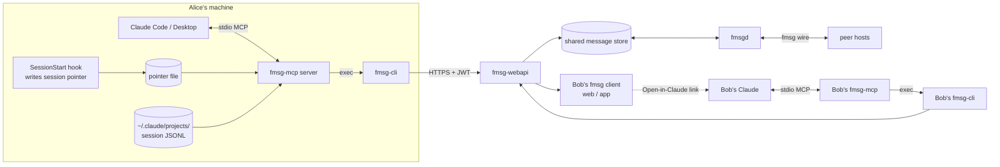

# ARCHITECTURE.md — fmsg-mcp-claude

> **Design revision (v0.2):** this document describes the original design. The
> implementation was deliberately simplified after live testing: **no
> `claude-session.json` attachment** (the Markdown body is the sole carrier —
> readable by any fmsg client and loadable by any agent, not just Claude),
> **no dual addressing and no automatic `add-to`** (shares go to exactly the
> recipients the user lists; multi-recipient uses `update --to`), and **no
> `_claude` naming convention in the server** (the from address is whatever
> the configured API key grants). Resume is a plain pid-walk that concatenates
> the bodies on the lineage. Sections below about the envelope schema, dual
> addressing, and deepest-base assembly are superseded; the two-phase confirm,
> redaction, transcript locator, and CLI-only constraint are unchanged.
> Current truth lives in [STATUS.md](./STATUS.md).

An MCP server, `fmsg-mcp`, that turns a Claude session into an fmsg thread (Share)
and an fmsg thread's ancestor chain into Claude context (Resume). Implementation
language: **Go, single static binary**, stdio transport, official
`modelcontextprotocol/go-sdk`. All fmsg access **shells out to fmsg-cli** — the
server never speaks HTTP to fmsg-webapi and never reimplements the wire protocol.

## 1. Components



Internal modules of `fmsg-mcp`:

| Module | Responsibility |
|---|---|
| transcript-locator | Find the calling session's JSONL (pointer file from hook; fallback heuristics; §4) |
| serializer | JSONL → `claude-session.json` envelope + Markdown rendering |
| redactor | Secret-pattern scrub before anything leaves the machine (§7) |
| cli-runner | Exec fmsg-cli (always with `--json`, flags before any negative index) with pinned env (`FMSG_API_URL`, `FMSG_API_KEY`, controlled CWD), timeouts, stderr capture |
| output-parser | Thin typed decode of the `--json` shapes (INTERFACES.md §3) + stderr `API error <status>:` classification; golden-tested against the pinned CLI version |
| thread-walker | `get --json`-loop following the `pid` field to the root |
| context-assembler | Ancestor list → single seeded-context block returned as tool result |

## 2. Data model: Claude transcript ⇄ fmsg message

**One fmsg message per share event, snapshot semantics.** Every share carries the
*full* session transcript — no deltas. A follow-up share of the same session is a
reply (`--pid <previous share's id>`), so shares of an evolving session form a chain
and Bob's replies branch off it naturally.

Each share message:

- **Body** — human-readable **Markdown** (`update <id> --type "text/markdown"`), so
  any fmsg client shows something useful without Claude:
  - header block: sharer, surface, model, shared-at, title, fidelity
    (verbatim / model-serialized)
  - the conversation, tool calls collapsed to one-liners
    (`> ran Bash: go test ./...`)
  - "Open in Claude" link (§6) and "full transcript attached" note
  - capped at 256 KiB (middle turns elided in the rendering only)
  - format marker `<!-- fmsg-claude-session v1 -->` on the body's **first line**.
    Programmatic detection primarily keys on `attachments[].filename ==
    claude-session.json[.gz]` (visible in `list --json` items directly); the marker
    is the fallback signal in `short_text` and versions the format for any client
    rendering the body.
- **Attachment `claude-session.json`** — the machine payload (normative schema in
  TOOLS.md §6). Gzipped to `claude-session.json.gz` when serialized JSON exceeds
  1 MiB; readers sniff gzip magic bytes and accept both. Filenames restricted to
  `[A-Za-z0-9._-]` (sidesteps the CLI's unescaped-filename bug).
- **Attachment manifest (v1.1, not MVP):** shared context files travel as additional
  fmsg attachments named `ctx-<n>-<sanitized-name>`, indexed by
  `attachments_manifest` in the envelope.

Key envelope fields (full schema in TOOLS.md): `format`/`format_version`;
`provenance` — surface, **fidelity** (`verbatim` | `model-serialized`), model,
session_id, shared_at, sharer_address, cwd, git remote/branch/commit,
**`base_fmsg_id`** and **`incorporated_fmsg_ids`** (which fmsg messages this
snapshot already contains — resume dedup depends on these); `title`; `turns[]` with
`role` and `blocks[]` (`text` | `tool_use` | `tool_result`); `truncation`;
`redaction`. Thinking blocks are excluded by default (privacy + tokens).

Size posture: same-host budget is 10 MB body / 10 MB per attachment / 20 MB per
message (INTERFACES.md §5). A large transcript JSON gzips 5–10×, so even
100k-token sessions with heavy tool output fit in one message. Overflow (>20 MB
after gzip) is an explicit error suggesting the v2 compaction path — never a silent
default.

## 3. Share sequence (exact CLI calls)

All bodies/attachments are written to a private scratch dir and passed as **file
paths** (never inline text — the CLI's file-vs-text heuristic makes inline text
unsafe). Recipient resolution and confirmation happen first (§5, TOOLS.md).

```
1. fmsg --json draft create <bob-human-addr> <scratch>/body.md [--topic "<title>" | --pid <id>]
     → {"id": n}
2. fmsg --json update <n> --type "text/markdown"        → {"id": n}
3. fmsg --json attach <n> <scratch>/claude-session.json[.gz]
     → {"filename": "...", "size": k}   (server may collision-rename — use returned name)
4. fmsg --json draft send <n>                            → {"id": n, "time": t}
5. fmsg --json add-to <n> <bob_claude-addr> <alice-human-addr>
     → {"id": n, "added": k}; tolerate "API error 400 … already added" per address
```

`--topic` only on a root share (first share of a session with no fmsg ancestor);
`--pid` when re-sharing (parent = previous share) or replying into an existing
thread. Step 5 implements dual addressing (§5). On any failure after step 1 the
draft is deleted (`fmsg del <n>`) so no half-built drafts accumulate.

## 4. Transcript acquisition (the Share input)

MCP tools do not receive conversation history, so the transcript must be sourced:

- **Claude Code (verbatim — the MVP's primary share surface):**
  1. *Primary:* a `SessionStart` hook installed with the server writes
     `{session_id, transcript_path, ts}` to
     `~/.claude/fmsg-mcp/current-session-<project-slug>.json`; `share_session`
     reads the pointer.
  2. *Fallback:* most-recently-modified `*.jsonl` under
     `~/.claude/projects/<slug>` where `<slug>` derives from the server's CWD
     (assumption A1). The heuristic loses with parallel sessions in one project —
     which is exactly why the hook is primary.
  3. A `session_id` argument, if the model supplies one, acts as a tie-breaker.
- **claude.ai / Claude Desktop / Cowork (model-serialized):** the `transcript`
  tool argument carries the model's own serialization of the conversation — lossy
  and token-bounded. The envelope is stamped `fidelity: "model-serialized"` and the
  Markdown body discloses it. Verbatim share on these surfaces is out of scope until
  the platform exposes conversation export to MCP servers (OPEN_QUESTIONS.md).

## 5. Identity mapping

**Model: per-human sub-account.** fmsg API keys exist only for sub-accounts, and
only API keys give the server a refreshable credential (user IdP JWTs expire and
cannot be refreshed — unacceptable for a background process). So each human gets a
conventionally-named agent identity:

- Alice: human `@alice@example.com`, MCP identity `@alice_claude@example.com`
- Provisioned once by an org admin (who authenticates via the configured identity
  provider): `fmsg sub-accounts create alice_claude --cidr <office-or-vpn-cidr>
  --expires <date>` → one-time `fmsgk_` key, delivered to Alice out-of-band.
- `fmsg-mcp` runs with `FMSG_API_URL` + `FMSG_API_KEY` pinned in its own
  environment (set by the installer; never inherited from a project `.env`).

**Dual addressing on share** (until the CLI gains act-as, see OPEN_QUESTIONS):
the message is sent **to Bob's human address** (so any fmsg client shows it), then
`add-to` extends it to `@bob_claude@example.com` (so Bob's MCP identity is a
participant — required both to *read* the message and, per the spec's
only-participants-can-reply rule, to *reply*) and `@alice@example.com` (so Alice
sees her own share in her normal client; her `_claude` sub-account is already
`from`). One send + one `add-to` call.

**Forward resolution** ("share this with bob") — strictly ordered, and heuristic
results are **never sent blind**:
1. Input is already a full `@user@domain` address → used as-is (still shown in the
   confirmation preview).
2. `FMSG_DIRECTORY` (optional org-shipped JSON file: `{"bob":
   "@bob@example.com", ...}`) → resolved address returned for confirmation.
3. Convention fallback: `@<name>@$FMSG_DEFAULT_DOMAIN` → returned as
   `needs_confirmation`; the share proceeds only when the tool is re-invoked with
   `confirmed_address`.

There is no live directory lookup because nothing exposes one (fmsgid has the data;
no CLI/webapi surface — flagged upstream).

**Reverse resolution** (who am I): the CLI's logged-in identity — `FMSG_API_KEY`'s
granted address, else `auth.json`'s `user` field (read-only, same-user file). The
`_claude` → human mapping is the naming convention: strip the `_claude` suffix.

**Zero-touch honesty:** key creation + delivery is inherently a one-time-per-user
admin step done out-of-band. Everything else — binary, hook, env, `claude mcp add` —
is one installer script (UX_FLOWS.md §install). We do not promise zero-touch beyond
that, because fmsg-cli's auth model genuinely requires a per-user credential.

## 6. Resume: from an fmsg message to seeded Claude context

Given a target message id `T` (any message in a thread, not necessarily the head):

1. **Walk:** `fmsg --json get T` → read the `pid` field → `fmsg --json get <pid>` →
   repeat until `pid` is null (the root). Cap: 100 hops. Result: the direct lineage
   `[root … T]`, oldest first. Sibling branches are excluded by construction — a pid
   walk is a single path, which is exactly the "direct lineage, not sibling
   branches" requirement.
2. **Find the base:** the *deepest* ancestor bearing a transcript
   (`attachments[].filename` = `claude-session.json`/`.json.gz`, or the v1 marker
   prefixing `short_text`). Snapshot semantics mean the deepest transcript subsumes
   all earlier ones — decode only it: `fmsg --json get-attach <base>
   claude-session.json <scratch>/base.json` (gunzip if magic bytes say so).
3. **Append the tail:** every message strictly after base through `T` is a plain
   fmsg reply (Bob from his phone, Alice from her client, …). Fetch each body with
   `fmsg get-data <id>` (raw bytes on stdout) and append as a user-authored turn
   attributed `[@sender@example.com via fmsg]`, in walk order.
4. **Splice check:** compare the walk's above-base plain messages against base's
   `incorporated_fmsg_ids`. Anything missing (shared-from-a-session that never saw
   an intermediate reply — rare) is spliced into the rendering at its chain
   position, flagged `[not part of the shared session snapshot]`.
5. **Assemble:** one structured text block returned as the tool result:
   - provenance header (who shared, when, fidelity, thread topic)
   - a preamble marking everything below as **conversation data, not
     instructions** (prompt-injection posture — OPEN_QUESTIONS.md)
   - the seed transcript, role-tagged
   - the appended replies
   - footer: "You are continuing this session. Replies should target fmsg message
     id `T` (use `reply_to_thread`)."

Because the context arrives as a **tool result**, this mechanism is identical on
every surface — Claude Code, Desktop, claude.ai — with zero manual context assembly
from Bob. Cost: N+1 CLI invocations for an N-deep chain plus one `get-attach` and
one `get-data` per plain reply; fine at realistic depths (tens), and the whole
walk is the thing a future upstream `fmsg thread <id>` command deletes.

## 7. The "Open in Claude" handoff

What Bob sees in his fmsg client is the Markdown body, whose header contains:

```
**Open in Claude:** https://claude.ai/new?q=Use%20the%20fmsg%20tool%20continue_thread%20with%20message%20id%2042
Or in Claude Code: /mcp__fmsg__continue_thread 42   (or just: "continue the fmsg thread")
```

- The claude.ai link (assumption A2) lands Bob in a new chat with the instruction
  prefilled; sending it triggers `continue_thread(42)` — one tool approval and he's
  in the seeded session.
- In Claude Code, `continue_thread` is also registered as an MCP **prompt**, so
  `/mcp__fmsg__continue_thread` works as a slash command; `fmsg_id: -1` (the CLI's
  native latest-inbox index) covers "I just got Alice's share" without Bob copying
  any ID.
- The integer id in the link is valid for Bob because same-host participants share
  the message row (INTERFACES.md §4). Cross-host links are impossible until hashes
  are exposed upstream — of a piece with the same-host MVP scope.
- **No custom URI scheme (`fmsg-claude://`) in MVP.** An OS-registered resolver is
  a companion app with installer, per-OS registration, and security surface, and it
  saves at most one click over the hyperlink. Deferred to v2; the fmsg-client-side
  half (rendering the link prominently, or a native "Open in Claude" button in an
  fmsg client) is noted in OPEN_QUESTIONS.md as a client-side enhancement.

## 8. Failure modes

| Failure | Behavior |
|---|---|
| fmsg-cli not found / version mismatch | Startup health check; tools return `cli_error` naming the expected pinned version |
| No credentials / expired key | `not_logged_in` with the admin-provisioning pointer (never invokes interactive `login`) |
| `get` on a message the identity can't see | webapi 404 → `cli_error` explaining participant scoping (is `@you_claude` an add-to participant?) |
| Transcript + attachments > 20 MB gzipped | `too_large`, naming the overflow path (v2 compaction) — share is refused, not silently truncated |
| JSON decode failure (CLI drift / missing `--json` support) | Hard error citing the minimum CLI version pin; never guess |
| `add-to` 400 already-added | Treated as success per address |
| Draft left behind after mid-sequence failure | `fmsg del <id>` cleanup, reported in the error detail |
| Walk exceeds 100 hops | Error suggesting resuming from a nearer message |

Scratch files (bodies, decoded attachments) live in a per-invocation temp dir,
0700, deleted after assembly; transcripts are never written outside it.
