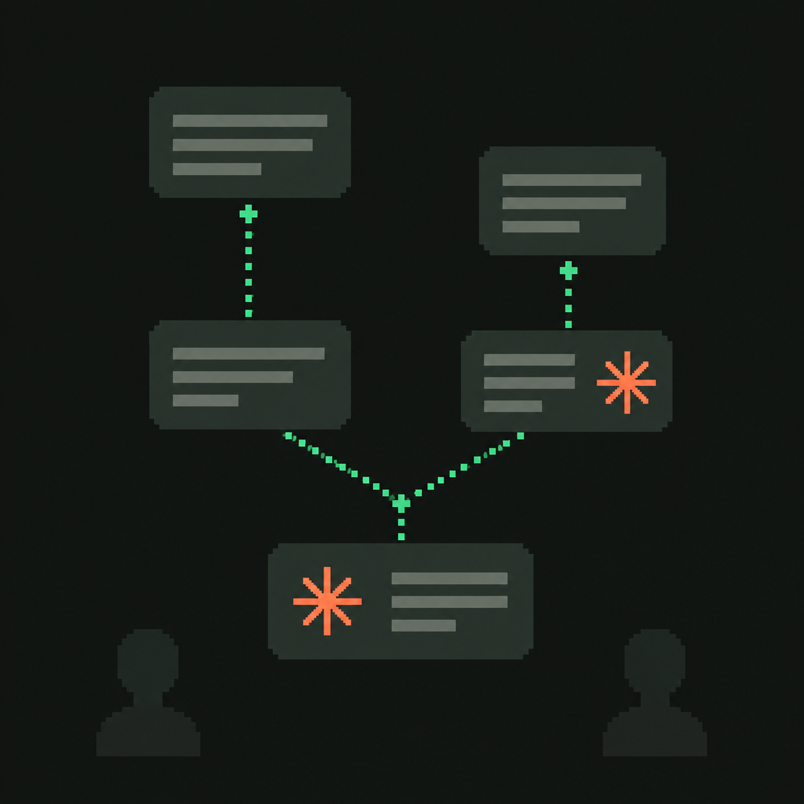

# CLAUDE fmsg MCP 



Share your Claude session with anyone as an [fmsg](https://github.com/markmnl/fmsg)
thread — and open any fmsg thread in Claude with the full conversation as
context. Shares are plain Markdown messages: readable in any fmsg client,
usable by any agent.

* Share your agent sessions with co-workers
* Branch your conversation at any point prior with ease
* Search and visualise prior conversations in an intuitive UI
<br/>
<br/>
All backed by durable fmsg threads.
<br/>
<br/>

## 1. Get an fmsg address + API key

You send as an fmsg address, authenticated by an API key (`fmsgk_…`):

- **No fmsg host?** Create a free account at **[fmsg.io](https://fmsg.io)**,
  then go to **Admin → Add Agent** — copy the **API URL** and **API key**
  shown there.
- **Self-hosting?** Run your own host with
  [fmsg-docker](https://github.com/markmnl/fmsg-docker).

## 2. Install

### Fastest: ask Claude to do it

Paste this into Claude (Claude Code, or any Claude that can run commands on
your machine), with your details filled in:

> Install the fmsg MCP server from
> https://github.com/markmnl/fmsg-mcp-claude — follow its README: download
> the right binary for my platform from the latest GitHub release, install
> it, register it with Claude, and set up the session hook. My fmsg API URL
> is `<paste API URL>` and my API key is `<paste fmsgk_… key>`. When done,
> verify by asking fmsg who I am.

On Claude Desktop, Claude can't install its own extensions — use the
`.mcpb` bundle below instead (it's two clicks).

### Claude Desktop (macOS / Windows)

1. Download the bundle for your platform from the
   [latest release](https://github.com/markmnl/fmsg-mcp-claude/releases/latest):
   `fmsg-darwin-arm64.mcpb` · `fmsg-darwin-x64.mcpb` · `fmsg-windows-x64.mcpb`
2. Double-click it (or Claude Desktop → Settings → Extensions → Install
   Extension…) and paste your fmsg Web API URL and API key when prompted.

That's it — everything needed is inside the bundle.

### Claude Code (Linux / macOS / Windows)

1. From the [latest release](https://github.com/markmnl/fmsg-mcp-claude/releases/latest),
   download `fmsg-mcp_<os>_<arch>` for your platform, put it somewhere like
   `~/bin/fmsg-mcp`, and `chmod +x` it. That's the only file — the fmsg CLI it
   uses is built in.
2. Register the server:

   ```sh
   claude mcp add fmsg \
     --env FMSG_API_URL=<your fmsg Web API URL> \
     --env FMSG_API_KEY=fmsgk_... \
     -- ~/bin/fmsg-mcp
   ```

3. Recommended — install the session hook so shares capture your session
   verbatim (without it, sharing still works from what Claude retells):

   ```sh
   mkdir -p ~/.claude/fmsg-mcp
   cp hooks/session-start.sh ~/.claude/fmsg-mcp/ && chmod +x ~/.claude/fmsg-mcp/session-start.sh
   ```

   and add to `~/.claude/settings.json`:

   ```json
   {"hooks": {"SessionStart": [{"hooks": [{"type": "command", "command": "~/.claude/fmsg-mcp/session-start.sh"}]}]}}
   ```

#### Windows

Same three steps, adjusted for Windows paths (no `chmod`, and the hook script
needs a POSIX shell — the Git Bash that ships with
[Git for Windows](https://git-scm.com/download/win) works):

1. Download `fmsg-mcp_windows_amd64.exe` from the
   [latest release](https://github.com/markmnl/fmsg-mcp-claude/releases/latest)
   to somewhere stable, e.g. `C:\Users\<you>\bin\fmsg-mcp.exe`.
2. Register the server:

   ```bat
   claude mcp add fmsg ^
     --env FMSG_API_URL=<your fmsg Web API URL> ^
     --env FMSG_API_KEY=fmsgk_... ^
     -- C:\Users\<you>\bin\fmsg-mcp.exe
   ```

3. Copy `hooks/session-start.sh` to
   `C:\Users\<you>\.claude\fmsg-mcp\session-start.sh` and add to
   `~/.claude/settings.json` (forward slashes, shell named explicitly):

   ```json
   {"hooks": {"SessionStart": [{"hooks": [{"type": "command", "shell": "bash",
     "command": "sh \"C:/Users/<you>/.claude/fmsg-mcp/session-start.sh\""}]}]}}
   ```

Release assets ship with a `SHA256SUMS` file to verify downloads against
(`sha256sum -c` / `certutil -hashfile … SHA256`).

### Claude Web (claude.ai)

Not yet — claude.ai only connects to *remote* MCP servers, and fmsg-mcp
currently runs locally. Use Claude Desktop or Claude Code for now; a hosted
connector is on the roadmap. (Resuming works everywhere the server runs,
because context is returned by the tools themselves.)

## 3. Use it

Just ask Claude, in any session:

- *"Share this session with `@kebbie@fmsg.io`"* — you'll get a preview
  (recipients, size, redactions) and nothing is sent until you approve.
- *"Summarise this session for `@kebbie@fmsg.io`"* — Claude writes a summary
  and sends it as a single message (with the same preview-and-approve step);
  summarising again later threads the update onto the same conversation.
- *"Send `@kebbie@fmsg.io` the weather today in London"* — sends exactly
  what you ask for, right away: a dictated text or an answer Claude
  composes, independent of the session.
- *"Continue my latest fmsg thread"* — Claude loads the whole thread as
  context and picks up where it left off.
- *"Reply to that thread: we shipped the fix"* — sends a Markdown reply to
  all participants.
- *"Did my share reach everyone?"* — per-recipient delivery status.

In Claude Code these are also slash commands: `/fmsg:share_session`,
`/fmsg:share_summary` and `/fmsg:continue_thread`.

**How shares work:** one Markdown fmsg message per prompt, chained with
fmsg's reply links — the thread mirrors your conversation, so recipients can
read it in any fmsg client, branch from any point, or load it into Claude or
any other agent. Shares carry only the conversation text — tool commands and
their output are excluded. Secrets (API keys, tokens, private keys) are
redacted before sending. Sent messages are immutable — they can't be edited
or recalled — so every share shows you a preview and asks before anything
goes out. (Direct sends — *"send @x …"* — skip the preview and go out
immediately; secrets are still redacted.)

**Share again as you go:** keep working after a share, share again, and only
the new exchanges are sent — chained onto the thread you already shared, so
long sessions never get resent from the top. This happens automatically when
the recipients are the same; a different audience (or a session whose earlier
content changed) starts a fresh full thread, so nobody receives a tail whose
beginning they can't read.

## Configuration

| Variable | Default | Purpose |
|---|---|---|
| `FMSG_API_URL` | `http://127.0.0.1:8000` | Your host's fmsg Web API base URL |
| `FMSG_API_KEY` | — | `fmsgk_…` API key; its granted address is who you send as |
| `FMSG_CLI` | *(built in)* | Override the bundled [fmsg-cli](https://github.com/markmnl/fmsg-cli) with your own binary |
| `FMSG_DEFAULT_DOMAIN` | — | Lets short names resolve: `bob` → `@bob@<domain>` |
| `FMSG_DIRECTORY` | — | JSON file mapping short names to full addresses |

## Development

```sh
go build -o fmsg-mcp .   # dev build: uses fmsg-cli from PATH (needs --json/whoami)
go test ./...
# release-style build with the CLI embedded:
#   cp <fmsg binary> internal/cli/embedded/fmsg-bin && go build -tags embedcli .
```

Design docs: [ARCHITECTURE.md](./ARCHITECTURE.md) · [TOOLS.md](./TOOLS.md) ·
[UX_FLOWS.md](./UX_FLOWS.md) · [INTERFACES.md](./INTERFACES.md) ·
[OPEN_QUESTIONS.md](./OPEN_QUESTIONS.md) · [PHASED_PLAN.md](./PHASED_PLAN.md)

[MIT licensed](./LICENSE) · [Privacy policy](./PRIVACY.md)
